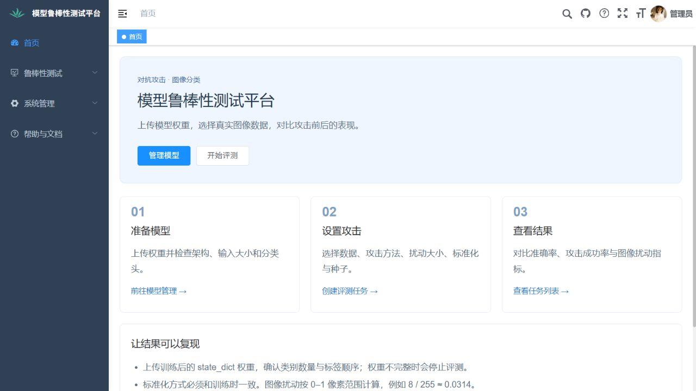

# 模型鲁棒性测试平台

基于 FastAPI、PyTorch 和 Vue 的图像分类模型鲁棒性评测工具。上传模型权重，选择 CIFAR-10 或自己的图像数据集，运行对抗攻击并查看准确率、攻击成功率和扰动量。



## 功能

- 模型上传、结构配置、查询和删除，支持标准架构和显式配置的分类头。
- FGSM、PGD、BIM、C&W、DeepFool 五种攻击。
- CIFAR-10 与 ZIP / ImageFolder 自定义数据集。
- 原始准确率、鲁棒准确率、攻击成功率、L2 / L∞ 扰动和置信度变化。
- 任务进度、结果图表，保存数据集、预处理方式和随机种子。
- 用户注册登录、个人资料、管理员用户管理，以及用户间模型、数据集与任务隔离。

## 本地运行

建议 Python 3.11 / 3.12、Node.js 20。默认使用 SQLite；首次启动不需要安装 MySQL。模型和数据集按需准备，不随源码上传。

在项目根目录打开终端，安装后端：

```powershell
python -m venv .venv
.\.venv\Scripts\python.exe -m pip install torch torchvision --index-url https://download.pytorch.org/whl/cpu
.\.venv\Scripts\python.exe -m pip install -r backend/requirements.txt
cd backend
..\.venv\Scripts\python.exe init_db.py
..\.venv\Scripts\python.exe -m uvicorn main:app --host 127.0.0.1 --port 8001
```

初始化时交互设置管理员密码；用户名为 `admin`。再次初始化不会重置已有账号或数据。使用 GPU 时，请按 PyTorch 官方安装说明选择与设备匹配的版本。

另开终端，从项目根目录安装前端：

```powershell
cd frontend
npm ci
$env:NODE_OPTIONS="--openssl-legacy-provider"
npm run dev
```

访问 **http://127.0.0.1:8080**。接口文档位于 **http://127.0.0.1:8001/docs**。前端开发服务器会代理接口；可用 `BACKEND_URL` 改变代理地址。

如需使用已有 MySQL 数据库或自定义存储位置，将 `backend/.env.example` 复制为 `backend/.env` 并填写自己的配置。已有数据库不会由程序自动覆盖或重建。`.env` 和运行数据已排除在版本控制之外。

## 正确准备模型与数据

上传 `.pth` / `.pt` 权重 checkpoint，例如：

```python
torch.save({
    "model_type": "resnet18",
    "state_dict": model.state_dict(),
    "img_size": 32,
}, "model.pth")
```

模型类别数从分类头权重推断。可识别常见 ResNet、VGG、DenseNet 和 MobileNet-v2；相近的 EfficientNet / MobileNet 变体需要在 checkpoint 或界面中明确架构。标准化方式也必须与训练时一致。

上传接口仅安全读取权重与基础元数据。序列化 Python 模型对象和 TorchScript 不由上传接口执行，请在可信环境中先导出权重。结构或权重不匹配时，模型需要补充配置，不会用未加载的随机参数继续评测。自定义分类头的激活层、Dropout 等不能仅从权重可靠恢复，需要明确配置。

自定义 ZIP 采用以下结构，允许外层再包一层目录：

```text
dataset/
  class_0/
    image_01.png
  class_1/
    image_02.jpg
```

类别目录按字母顺序映射为标签，必须与训练时的标签顺序一致；界面会显示类别列表。模型输出维度必须与类别数一致。ZIP 最大 500 MB、解压后最多 1 GiB / 20,000 项；不接受路径越界与符号链接。单类别目录也可正常上传。

攻击输入保持在 `[0, 1]` 像素空间，模型标准化在内部执行。因此 `eps=0.03` 指原始像素范围的扰动上限，L2 / L∞ 指标也在像素空间计算。C&W、DeepFool 按自身方法优化，`eps` 不作为它们的强制约束。采样和攻击记录随机种子；跨硬件结果仍可能存在差异。

数据加载失败会显示错误，不会改用随机图像或另一个数据集。小样本只能用于流程验证，可靠评测需要匹配的真实测试集和训练好的模型。

## 测试与构建

```powershell
.\.venv\Scripts\python.exe -m pip install -r backend/requirements-dev.txt
.\.venv\Scripts\python.exe -m pytest backend/tests -q
cd frontend
$env:NODE_OPTIONS="--openssl-legacy-provider"
npm run build:prod
```

回归测试覆盖真实 ResNet 架构识别、权重完整性、安全加载、真实图像的小型完整评测、扰动单位、数据下载失败、ZIP 目录、账号权限、密码重置和后台响应。[修复记录](docs/BUG_FIXES.md) 说明发现的问题和验证方法，[本轮验证](docs/VALIDATION.md) 记录测试数量与真实网页流程。

## 当前边界

- 这是本地研究工具。使用单个 Uvicorn worker；登录会话保存在内存中，重启后需重新登录。重启中断的任务会标为失败，需重新创建。
- 后台评测顺序执行以控制资源占用；状态查询可继续响应。大型模型和迭代攻击需要足够的内存与计算时间。
- 管理员可管理用户；角色、部门、菜单的部分编辑接口仍是待实现功能，返回明确的 501 提示。没有实现的操作不会报告“成功”。
- 前端沿用 Vue 2 / Vue CLI 4，尚未迁移到新版前端框架。生产部署应另行配置认证、反向代理、持久化队列和访问范围。

## 项目结构与来源

```text
backend/   API、模型加载、攻击引擎、数据集、SQLite / MySQL 配置、测试
frontend/  Vue / Element UI 界面
docs/      修复记录与项目说明
```

前端基于 [RuoYi-Vue](https://github.com/yangzongzhuan/RuoYi-Vue)，保留 [原 MIT 许可证](frontend/LICENSE)。攻击实现使用 [torchattacks](https://github.com/Harry24k/adversarial-attacks-pytorch)，模型架构使用 torchvision。源码不包含原项目的私人论文、答辩材料、用户数据库、模型权重或数据集。
